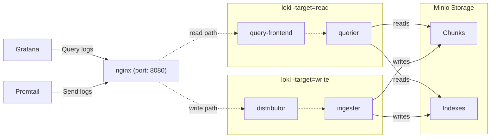

# docker-compose-prometheus
Just needed this to test out a couple things w/ a python asyncio app


# How to query loki

`{container_name="bossjones/fluentd-elasticsearch:v4.0.0",job="containerlogs"} | pattern `<_> <_> <_> <_>: <firewall_log>``

`{container_name="bossjones/fluentd-elasticsearch:v4.0.0",job="containerlogs"} | pattern `<firewall_year>-<firewall_month>-<firewall_day> <firewall_hour>:<firewall_minute>:<firewall_second> <firewall_offset> <firewall_fluentd_label>: <firewall_log>``

`{container_name="bossjones/fluentd-elasticsearch:v4.0.0",job="containerlogs"} | pattern `<_> <_> <_> <_>: <firewall_log>` | json  | line_format "{{.firewall_log}}"`

- [ ] https://grafana.com/blog/2020/12/08/how-to-create-fast-queries-with-lokis-logql-to-filter-terabytes-of-logs-in-seconds/
- [ ] https://grafana.com/blog/2021/08/09/new-in-loki-2.3-logql-pattern-parser-makes-it-easier-to-extract-data-from-unstructured-logs/


## How to setup

1. cp -a .envrc.sample .envrc
2. direnv allow .
3. python3 -m venv venv
4. . ./venv/bin/activate
5. pip install -r requirements.txt
6. modify data.yaml
7. make render
8. cd ./outputs
9. docker-compose --env-file env ps
10. docker-compose --env-file env up

https://github.com/microdevops-com/microdevops-formula/blob/61ac0273f2e7559d73344934164ccc850eff52c0/loki/pillar.example


# unifi

https://docs.nxlog.co/userguide/integrate/unifi.html

```
This NXLog configuration uses the im_udp input module to listen for syslog messages on UDP port 514. It parses each message and uses regular expressions to extract further UniFi-specific fields from the event.

nxlog.conf
<Extension syslog>
    Module        xm_syslog
</Extension>

<Extension json>
    Module        xm_json
</Extension>

<Input syslog_udp>
    Module        im_udp
    ListenAddr    0.0.0.0:514
    <Exec>
        parse_syslog();
        if $Message =~ / ([a-z]*): (.*)$/
        {
            $UFProcess = $1;
            $UFMessage = $2;
            if $UFMessage =~ /^([a-z0-9]*): (.*)$/
            {
                $UFSubsys = $1;
                $UFMessage = $2;
                if $UFMessage =~ /^STA (.*) ([A-Z0-9. ]*): (.*)$/
                {
                    $UFMac = $1;
                    $UFProto = $2;
                    $UFMessage = $3;
                }
            }
        }
        to_json();
    </Exec>
</Input>
```
# Diagram

The below diagram describes the various components of this deployment, and how data flows between them.




Simply run `docker-compose up` and all the components will start.

It'll take a few seconds for all the components to start up and register in the [ring](http://localhost:8080/ring). Once all instances are `ACTIVE`, Loki will start accepting reads and writes. All logs will be stored with the tenant ID `docker`.

All data will be stored in the `.data` directory.

The nginx gateway runs on port `8080` and you can access Loki through it.

Prometheus runs on port `9090`, and you can access all metrics from Loki & Promtail here.

Grafana runs on port `3000`, and there are Loki & Prometheus datasources enabled by default.

## Endpoints

- [`/ring`](http://localhost:8080/ring) - view all components registered in the hash ring
- [`/config`](http://localhost:8080/config) - view the configuration used by Loki
- [`/memberlist`](http://localhost:8080/memberlist) - view all components in the memberlist cluster
- [all other Loki API endpoints](https://grafana.com/docs/loki/latest/api/)


## Setup pihole on boss-monitoring

```
# https://github.com/pi-hole/docker-pi-hole/tree/master

sudo sed -r -i.orig 's/#?DNSStubListener=yes/DNSStubListener=no/g' /etc/systemd/resolved.conf

cat /etc/resolv.conf

sudo sh -c 'rm /etc/resolv.conf && ln -s /run/systemd/resolve/resolv.conf /etc/resolv.conf'

sudo systemctl restart systemd-resolved
```

## Old configs

```
pi@boss-monitor ~/dev/bossjones/docker-compose-prometheus/outputs feature-perf
❯ cat /etc/systemd/resolved.conf
#  This file is part of systemd.
#
#  systemd is free software; you can redistribute it and/or modify it under the
#  terms of the GNU Lesser General Public License as published by the Free
#  Software Foundation; either version 2.1 of the License, or (at your option)
#  any later version.
#
# Entries in this file show the compile time defaults. Local configuration
# should be created by either modifying this file, or by creating "drop-ins" in
# the resolved.conf.d/ subdirectory. The latter is generally recommended.
# Defaults can be restored by simply deleting this file and all drop-ins.
#
# Use 'systemd-analyze cat-config systemd/resolved.conf' to display the full config.
#
# See resolved.conf(5) for details.

[Resolve]
# Some examples of DNS servers which may be used for DNS= and FallbackDNS=:
# Cloudflare: 1.1.1.1#cloudflare-dns.com 1.0.0.1#cloudflare-dns.com 2606:4700:4700::1111#cloudflare-dns.com 2606:4700:4700::1001#cloudflare-dns.com
# Google:     8.8.8.8#dns.google 8.8.4.4#dns.google 2001:4860:4860::8888#dns.google 2001:4860:4860::8844#dns.google
# Quad9:      9.9.9.9#dns.quad9.net 149.112.112.112#dns.quad9.net 2620:fe::fe#dns.quad9.net 2620:fe::9#dns.quad9.net
#DNS=
#FallbackDNS=
#Domains=
#DNSSEC=no
#DNSOverTLS=no
#MulticastDNS=no
#LLMNR=no
#Cache=no-negative
#CacheFromLocalhost=no
DNSStubListener=no
#DNSStubListenerExtra=
#ReadEtcHosts=yes
#ResolveUnicastSingleLabel=no

pi@boss-monitor ~/dev/bossjones/docker-compose-prometheus/outputs feature-perf
❯ cat /etc/resolv.conf
# This is /run/systemd/resolve/stub-resolv.conf managed by man:systemd-resolved(8).
# Do not edit.
#
# This file might be symlinked as /etc/resolv.conf. If you're looking at
# /etc/resolv.conf and seeing this text, you have followed the symlink.
#
# This is a dynamic resolv.conf file for connecting local clients to the
# internal DNS stub resolver of systemd-resolved. This file lists all
# configured search domains.
#
# Run "resolvectl status" to see details about the uplink DNS servers
# currently in use.
#
# Third party programs should typically not access this file directly, but only
# through the symlink at /etc/resolv.conf. To manage man:resolv.conf(5) in a
# different way, replace this symlink by a static file or a different symlink.
#
# See man:systemd-resolved.service(8) for details about the supported modes of
# operation for /etc/resolv.conf.

nameserver 127.0.0.53
options edns0 trust-ad
search scarlettlab.home

pi@boss-monitor ~/dev/bossjones/docker-compose-prometheus/outputs feature-perf
❯ cat /etc/resolv.conf
# This is /run/systemd/resolve/stub-resolv.conf managed by man:systemd-resolved(8).
# Do not edit.
#
# This file might be symlinked as /etc/resolv.conf. If you're looking at
# /etc/resolv.conf and seeing this text, you have followed the symlink.
#
# This is a dynamic resolv.conf file for connecting local clients to the
# internal DNS stub resolver of systemd-resolved. This file lists all
# configured search domains.
#
# Run "resolvectl status" to see details about the uplink DNS servers
# currently in use.
#
# Third party programs should typically not access this file directly, but only
# through the symlink at /etc/resolv.conf. To manage man:resolv.conf(5) in a
# different way, replace this symlink by a static file or a different symlink.
#
# See man:systemd-resolved.service(8) for details about the supported modes of
# operation for /etc/resolv.conf.

nameserver 127.0.0.53
options edns0 trust-ad
search scarlettlab.home

pi@boss-monitor ~/dev/bossjones/docker-compose-prometheus/outputs feature-perf
❯

pi@boss-monitor ~/dev/bossjones/docker-compose-prometheus/outputs feature-perf
❯ ls -lta /run/systemd/resolve/resolv.conf
-rw-r--r-- 1 systemd-resolve systemd-resolve 801 Jul 21 03:11 /run/systemd/resolve/resolv.conf

pi@boss-monitor ~/dev/bossjones/docker-compose-prometheus/outputs feature-perf
❯ cat /run/systemd/resolve/resolv.conf
# This is /run/systemd/resolve/resolv.conf managed by man:systemd-resolved(8).
# Do not edit.
#
# This file might be symlinked as /etc/resolv.conf. If you're looking at
# /etc/resolv.conf and seeing this text, you have followed the symlink.
#
# This is a dynamic resolv.conf file for connecting local clients directly to
# all known uplink DNS servers. This file lists all configured search domains.
#
# Third party programs should typically not access this file directly, but only
# through the symlink at /etc/resolv.conf. To manage man:resolv.conf(5) in a
# different way, replace this symlink by a static file or a different symlink.
#
# See man:systemd-resolved.service(8) for details about the supported modes of
# operation for /etc/resolv.conf.

nameserver 192.168.3.1
search scarlettlab.home

pi@boss-monitor ~/dev/bossjones/docker-compose-prometheus/outputs feature-perf
❯ ls -lta /etc/resolv.conf
lrwxrwxrwx 1 root root 39 Mar 19  2022 /etc/resolv.conf -> ../run/systemd/resolve/stub-resolv.conf

pi@boss-monitor ~/dev/bossjones/docker-compose-prometheus/outputs feature-perf
❯ cp -a /etc/resolv.conf resolv.conf.bak

pi@boss-monitor ~/dev/bossjones/docker-compose-prometheus/outputs feature-perf*
❯ sudo sh -c 'rm /etc/resolv.conf && ln -s /run/systemd/resolve/resolv.conf /etc/resolv.conf'

pi@boss-monitor ~/dev/bossjones/docker-compose-prometheus/outputs feature-perf*
❯ sudo systemctl restart systemd-resolved

pi@boss-monitor ~/dev/bossjones/docker-compose-prometheus/outputs feature-perf*
❯ sudo systemctl restart systemd-resolved

pi@boss-monitor ~/dev/bossjones/docker-compose-prometheus/outputs feature-perf*
❯ ls /etc/netplan
01-network-manager-all.yaml

pi@boss-monitor ~/dev/bossjones/docker-compose-prometheus/outputs feature-perf*
❯ cat /etc/netplan/01-network-manager-all.yaml
# Let NetworkManager manage all devices on this system
network:
  version: 2
  renderer: NetworkManager

pi@boss-monitor ~/dev/bossjones/docker-compose-prometheus/outputs feature-perf*
❯ docker info
Client: Docker Engine - Community
 Version:    24.0.2
 Context:    default
 Debug Mode: false
 Plugins:
  buildx: Docker Buildx (Docker Inc.)
    Version:  v0.10.5
    Path:     /usr/libexec/docker/cli-plugins/docker-buildx
  compose: Docker Compose (Docker Inc.)
    Version:  v2.18.1
    Path:     /usr/libexec/docker/cli-plugins/docker-compose
  scan: Docker Scan (Docker Inc.)
    Version:  v0.23.0
    Path:     /usr/libexec/docker/cli-plugins/docker-scan

Server:
 Containers: 27
  Running: 25
  Paused: 0
  Stopped: 2
 Images: 462
 Server Version: 24.0.2
 Storage Driver: overlay2
  Backing Filesystem: extfs
  Supports d_type: true
  Using metacopy: false
  Native Overlay Diff: true
  userxattr: false
 Logging Driver: json-file
 Cgroup Driver: systemd
 Cgroup Version: 2
 Plugins:
  Volume: local
  Network: bridge host ipvlan macvlan null overlay
  Log: awslogs fluentd gcplogs gelf journald json-file local logentries splunk syslog
 Swarm: inactive
 Runtimes: io.containerd.runc.v2 runc
 Default Runtime: runc
 Init Binary: docker-init
 containerd version: 3dce8eb055cbb6872793272b4f20ed16117344f8
 runc version: v1.1.7-0-g860f061
 init version: de40ad0
 Security Options:
  apparmor
  seccomp
   Profile: builtin
  cgroupns
 Kernel Version: 5.15.0-67-generic
 Operating System: Ubuntu 22.04.2 LTS
 OSType: linux
 Architecture: x86_64
 CPUs: 4
 Total Memory: 15.51GiB
 Name: boss-monitor
 ID: VQHK:AHDR:F7GG:QUGQ:TQG2:FAA7:7H3I:2QGW:ONW3:ITHE:F2HW:36WO
 Docker Root Dir: /var/lib/docker
 Debug Mode: false
 Username: bossjones
 Experimental: true
 Insecure Registries:
  127.0.0.0/8
 Live Restore Enabled: false


pi@boss-monitor ~/dev/bossjones/docker-compose-prometheus/outputs feature-perf* 9s
❯

```

# alert manager email example

```
# SOURCE: https://github.com/Suyeshsingh/Prometheus-Alert-Manager-With-Loki-Stack-Grafana/blob/main/Prometheus-Alert-Manager%20/alert-manager-configmap.yaml
kind: ConfigMap
apiVersion: v1
metadata:
  name: alertmanager-config
  namespace: monitoring
data:
  config.yml: |-
    global:
    templates:
    - '/etc/alertmanager/*.tmpl'
    route:
      receiver: alert-emailer
      group_by: ['alertname', 'priority']
      group_wait: 10s
      repeat_interval: 30m

    receivers:
    - name: alert-emailer
      email_configs:
      - to: suyeshsingh@outlook.com
        send_resolved: true
        from: from-email@email.com
        smarthost: smtp.eample.com:25
        require_tls: false
        auth_username: mail_id@gmail.com
        auth_identity: mail_id@gmail.com
        auth_password: <Enter password here>
```


## stahtd parse

```
# for log line: stahtd: stahtd[1440]: [STA-TRACKER].stahtd_dump_event(): {"message_type":"STA_ASSOC_TRACKER","mac":"f4:d4:88:5d:b1:ce","vap":"ath2","event_type":"fixup","assoc_status":"0","event_id":"4","arp_reply_gw_seen":"yes","dns_resp_seen":"yes","avg_rssi":"-69"}

{job="syslog"} |~ ".*stahtd.*" | regexp "^(?P<stahtd_logs>.*?) (?P<stahtd_json>\\{.*?\\})"

produces:

cluster
k3d

host
UniFiAP-AC-Pro

job
syslog

stahtd_json
{"message_type":"STA_ASSOC_TRACKER","mac":"20:fe:00:d8:fc:c2","vap":"ath2","event_type":"fixup","assoc_status":"0","event_id":"1","arp_reply_gw_seen":"yes","dns_resp_seen":"yes","avg_rssi":"-65"}

stahtd_logs
stahtd: stahtd[1440]: [STA-TRACKER].stahtd_dump_event():

```

### All WAN related firewall rules

```
{job="syslog"} |~ ".*WAN.*" |  pattern `[<firewall_action>]` | logfmt
```
