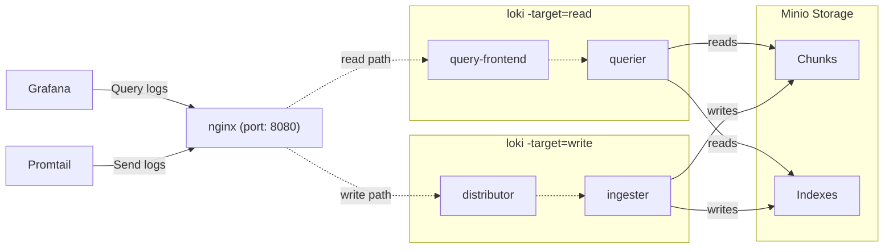

# docker-compose-prometheus
Just needed this to test out a couple things w/ a python asyncio app


# How to query loki

`{container_name="bossjones/fluentd-elasticsearch:v4.0.0",job="containerlogs"} | pattern `<_> <_> <_> <_>: <firewall_log>``

`{container_name="bossjones/fluentd-elasticsearch:v4.0.0",job="containerlogs"} | pattern `<firewall_year>-<firewall_month>-<firewall_day> <firewall_hour>:<firewall_minute>:<firewall_second> <firewall_offset> <firewall_fluentd_label>: <firewall_log>``

`{container_name="bossjones/fluentd-elasticsearch:v4.0.0",job="containerlogs"} | pattern `<_> <_> <_> <_>: <firewall_log>` | json  | line_format "{{.firewall_log}}"`

- [ ] https://grafana.com/blog/2020/12/08/how-to-create-fast-queries-with-lokis-logql-to-filter-terabytes-of-logs-in-seconds/
- [ ] https://grafana.com/blog/2021/08/09/new-in-loki-2.3-logql-pattern-parser-makes-it-easier-to-extract-data-from-unstructured-logs/


## How to setup

1. cp -a .envrc.sample .envrc
2. direnv allow .
3. python3 -m venv venv
4. . ./venv/bin/activate
5. pip install -r requirements.txt
6. modify data.yaml
7. make render
8. cd ./outputs
9. docker-compose --env-file env ps
10. docker-compose --env-file env up

https://github.com/microdevops-com/microdevops-formula/blob/61ac0273f2e7559d73344934164ccc850eff52c0/loki/pillar.example


# unifi

https://docs.nxlog.co/userguide/integrate/unifi.html

```
This NXLog configuration uses the im_udp input module to listen for syslog messages on UDP port 514. It parses each message and uses regular expressions to extract further UniFi-specific fields from the event.

nxlog.conf
<Extension syslog>
    Module        xm_syslog
</Extension>

<Extension json>
    Module        xm_json
</Extension>

<Input syslog_udp>
    Module        im_udp
    ListenAddr    0.0.0.0:514
    <Exec>
        parse_syslog();
        if $Message =~ / ([a-z]*): (.*)$/
        {
            $UFProcess = $1;
            $UFMessage = $2;
            if $UFMessage =~ /^([a-z0-9]*): (.*)$/
            {
                $UFSubsys = $1;
                $UFMessage = $2;
                if $UFMessage =~ /^STA (.*) ([A-Z0-9. ]*): (.*)$/
                {
                    $UFMac = $1;
                    $UFProto = $2;
                    $UFMessage = $3;
                }
            }
        }
        to_json();
    </Exec>
</Input>
```
# Diagram

The below diagram describes the various components of this deployment, and how data flows between them.




Simply run `docker-compose up` and all the components will start.

It'll take a few seconds for all the components to start up and register in the [ring](http://localhost:8080/ring). Once all instances are `ACTIVE`, Loki will start accepting reads and writes. All logs will be stored with the tenant ID `docker`.

All data will be stored in the `.data` directory.

The nginx gateway runs on port `8080` and you can access Loki through it.

Prometheus runs on port `9090`, and you can access all metrics from Loki & Promtail here.

Grafana runs on port `3000`, and there are Loki & Prometheus datasources enabled by default.

## Endpoints

- [`/ring`](http://localhost:8080/ring) - view all components registered in the hash ring
- [`/config`](http://localhost:8080/config) - view the configuration used by Loki
- [`/memberlist`](http://localhost:8080/memberlist) - view all components in the memberlist cluster
- [all other Loki API endpoints](https://grafana.com/docs/loki/latest/api/)
